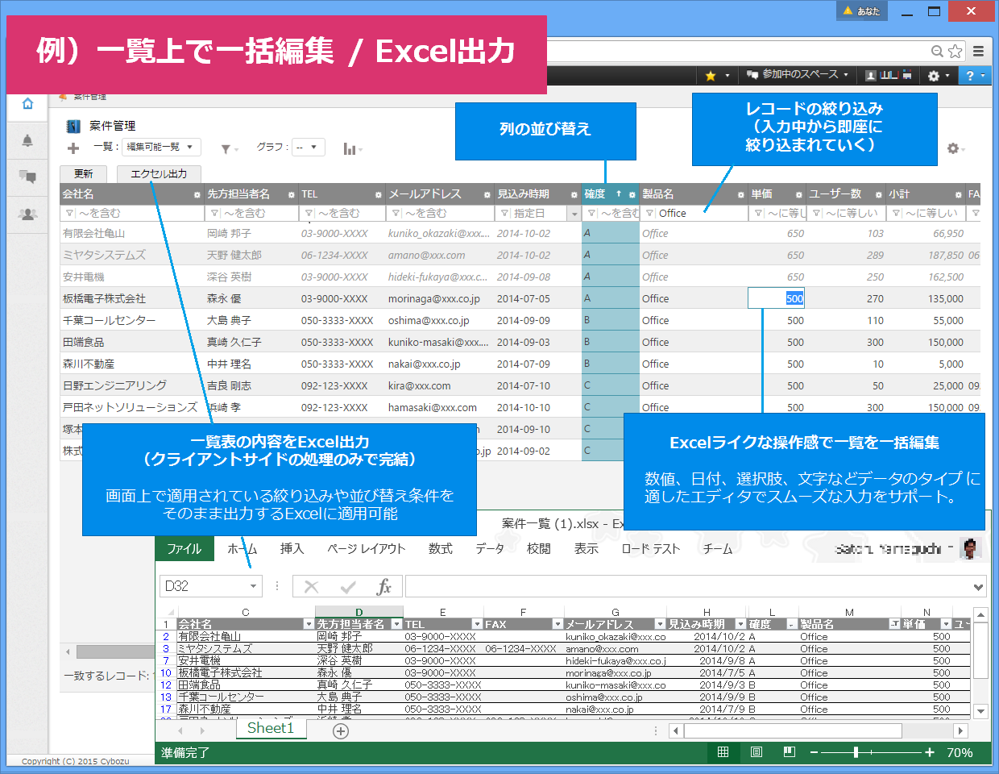
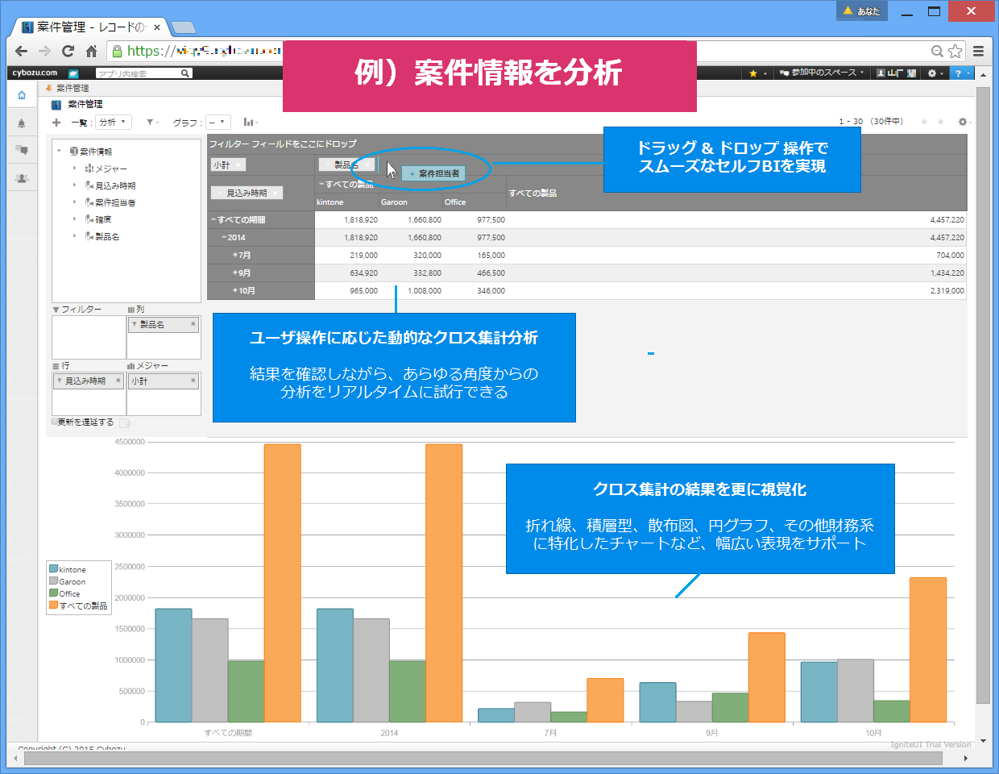
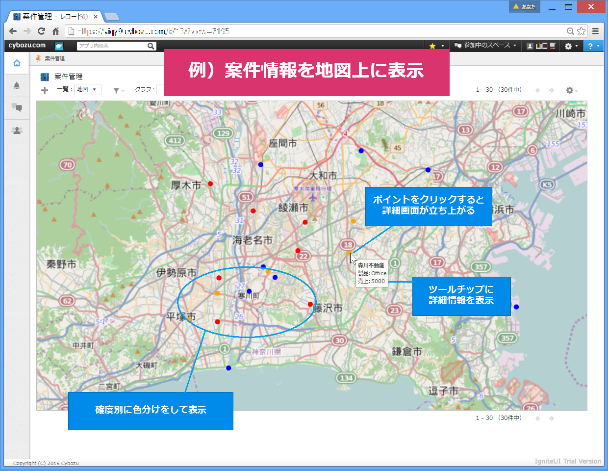
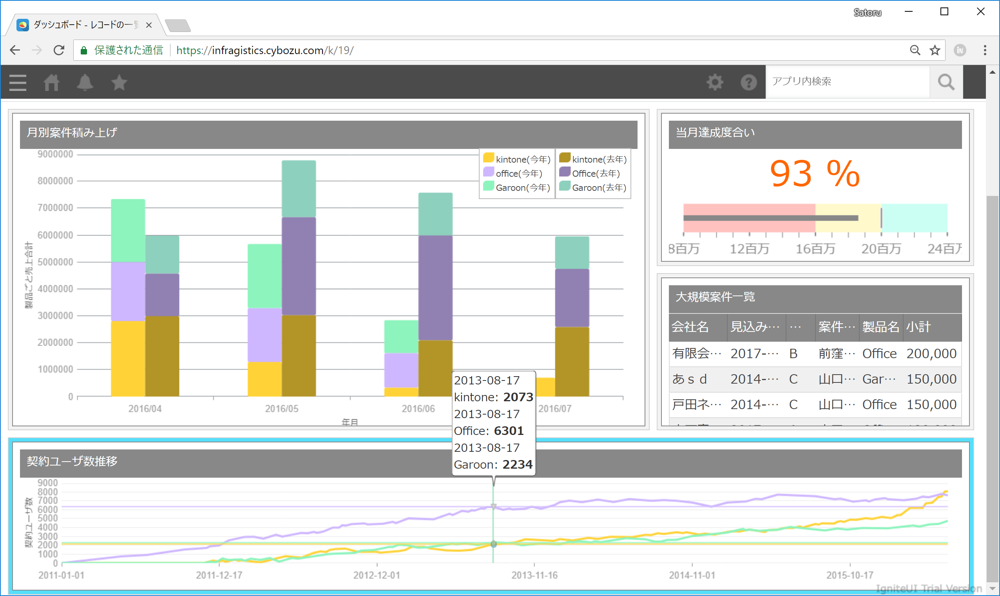
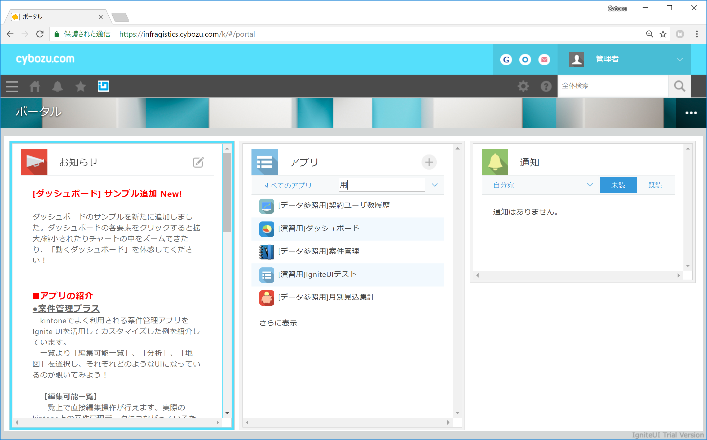

# このリポジトリについて

このリポジトリでは、Ignite UI を利用して kintone アプリをリッチにするサンプルコードを公開しています。

## サンプルコードの説明

src フォルダ以下にそれぞれのカスタム一覧に利用するソースコードを配置しています。Ignite UI の基本的な利用方法はデモアプリの確認は以下の Cybozu Developer Network 掲載記事 をご確認下さい。

- [Cybozu Developer Network: Ignite UI について](https://developer.cybozu.io/hc/ja/articles/206306286-Ignite-UI-%E3%82%A4%E3%83%B3%E3%83%95%E3%83%A9%E3%82%B8%E3%82%B9%E3%83%86%E3%82%A3%E3%83%83%E3%82%AF%E3%82%B9-%E3%82%B8%E3%83%A3%E3%83%91%E3%83%B3%E6%A0%AA%E5%BC%8F%E4%BC%9A%E7%A4%BE-)

また、各 Javascript/CSS ファイルのの配置については、src 下の各フォルダ内の ファイル配置.md をご確認ください。

 

## 01_編集可能一覧 - Excel出力付き
一覧上での編集、ソート、フィルタ、列移動、列幅変更などの機能に加えて、エクセルファイル出力などが出来ます。 
[ソースコードへ移動](src/01_編集可能一覧-Excel出力付き)

## 02_ピボット集計
ピボットテーブル上で、ユーザ自身が行や列、フィルタの設定を行い、ドリルダウンなどデータの視覚化・分析を行うことができます。 
[ソースコードへ移動](src/02_ピボット集計)

## 03_地図
地図上に kintone のアプリレコードに保持する情報をプロットできます。 
[ソースコードへ移動](src/03_地図)

## 04_ダッシュボード
複数のアプリからデータを抽出し、一つのダッシュボード上で表現している「動くダッシュボード」サンプルです。ダッシュボード内の各要素をクリック/タップするとその要素を拡大/最大化できます。 
[ソースコードへ移動](src/04_ダッシュボード)

## 05_ポータル
kintone ポータルのカスタマイズ例です。画面内に全ペインを表示して各ペイン毎に独立してスクロールできます。また、各ペインの最大化/最小化やアプリの検索ができます。 
[ソースコードへ移動](src/05_ポータル)

 

## 注意書き
このリポジトリ上のコードは、Ignite UI 本体に含まれるものではなく、あくまで活用例を示すサンプルコードです。リポジトリ管理者が kintone のアップデートに追従してメンテナンスは行っていく予定ですが、動作を保証するものではないため、ご自身の判断でソースコードの利用しテストを行って下さい。